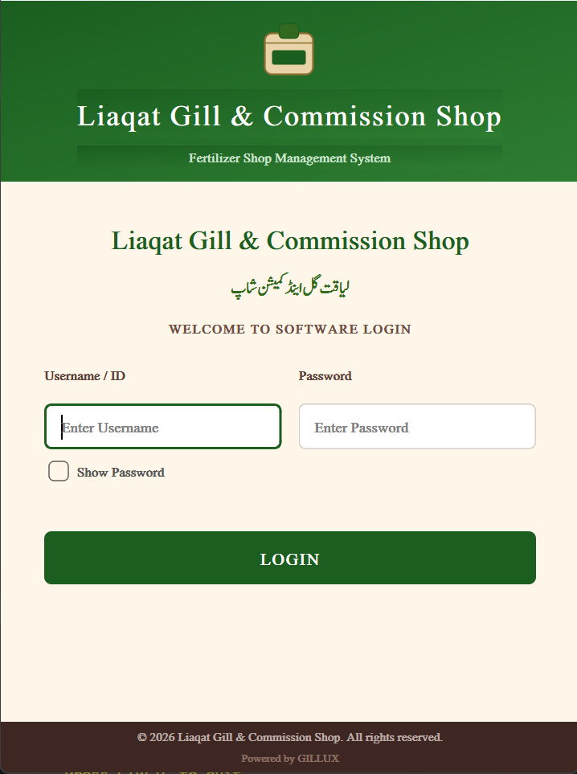
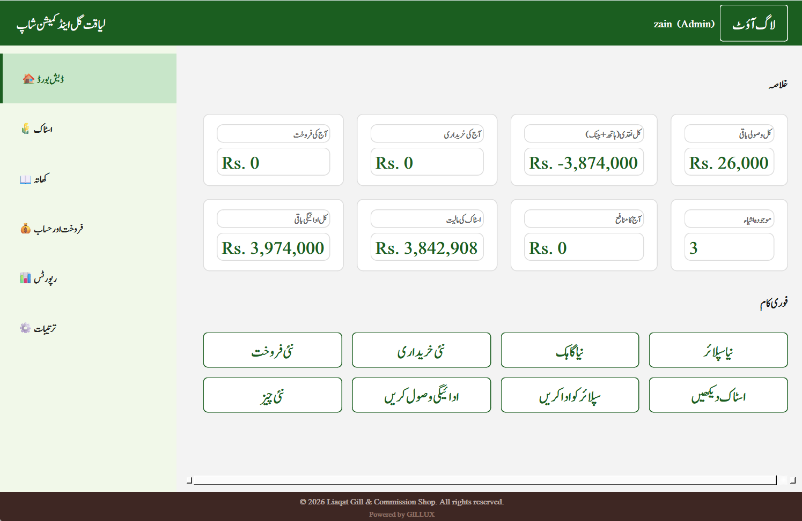
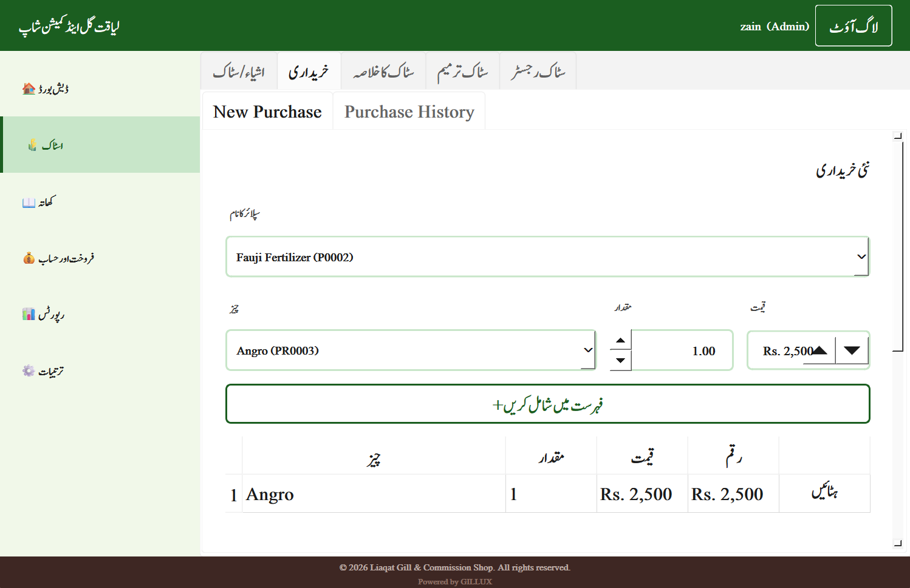
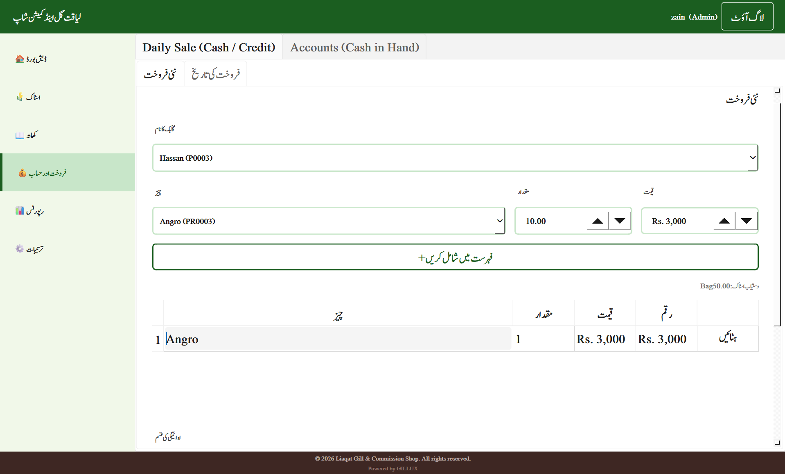
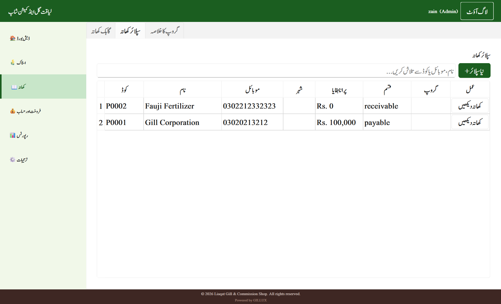
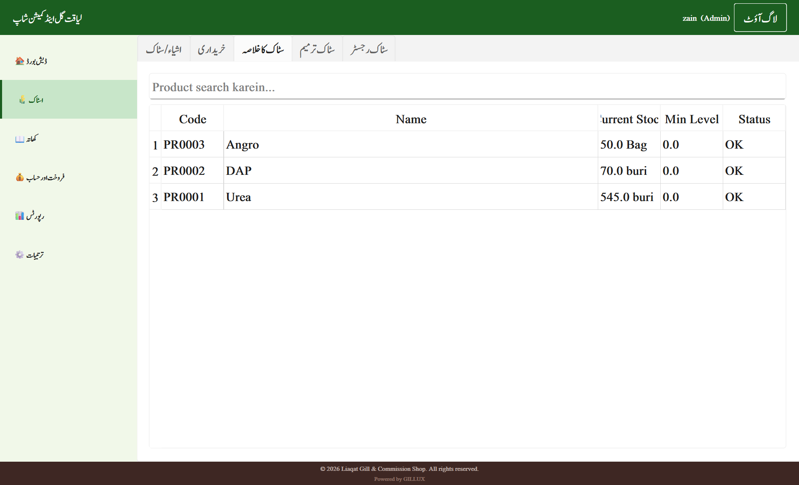
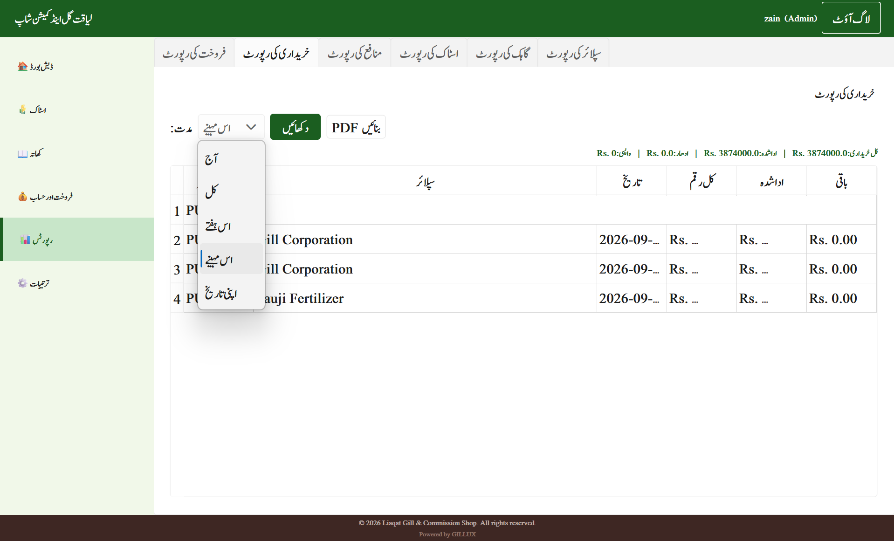

# GILLUX — Fertilizer Shop Management System

A professional, Urdu-localized desktop application for managing a fertilizer
(khaad) shop's day-to-day operations — built with Python, PySide6, and SQLAlchemy.

## Screenshots

### Login Screen


### Dashboard


### Purchase


### Sales


### Customer Ledger (Khaata)


### Stock Register


### Reports


## Features

- **Authentication** — role-based login (Admin / Employee) with bcrypt password hashing
- **Sales & Purchases** — invoice creation with cash/credit support, stock validation, PDF invoice generation
- **Stock Management** — weighted-average costing, stock register, low-stock alerts, manual adjustments
- **Customer & Supplier Ledgers (Khaata)** — full running-balance ledger, payments, customer grouping
- **Cash Book & Bank Accounts** — multi-account cash tracking with combined totals
- **Returns** — sales and purchase returns with proper stock/ledger reversal (no destructive deletes)
- **Reports** — Sales, Purchase, Stock, Profit, Customer, and Supplier reports with PDF export
- **Audit Log** — every financial action is logged with user, timestamp, and reference
- **Backup / Restore** — one-click database backup with automatic safety-backup on restore
- **Read-only Mobile Companion View** — a lightweight Flask web dashboard, viewable from any phone
  on the same local network, for checking stock and ledgers on the go
- **Urdu-first UI** — sidebar, forms, ledgers, and stock register follow the layout of a traditional
  Urdu shop register (کھاتہ بنام / سٹاک رجسٹر)

## Tech Stack

| Layer | Technology |
|---|---|
| GUI | PySide6 (Qt for Python) |
| Database | SQLite |
| ORM | SQLAlchemy |
| PDF Generation | ReportLab |
| Excel Export | openpyxl |
| Mobile Companion | Flask |
| Packaging | PyInstaller |

## Architecture

The app follows a layered architecture:

UI (PySide6 widgets)
↓
Services (business logic)
↓
Repositories (database queries)
↓
Database (SQLAlchemy models + SQLite)

This keeps the UI, business rules, and data access independent — a change to
one layer (e.g. swapping SQLite for another database) doesn't require touching
the others.

## Setup

```bash
git clone <this-repo-url>
cd GILLUX
python -m venv venv
venv\Scripts\activate        # Windows
pip install -r requirements.txt
python app.py
```

On first launch, the app will prompt you to create an Admin account, then
walk you through initial setup (shop details, first product, etc.) from
within the Settings screen.

## Project Structure

GILLUX/
├── app.py # Entry point
├── config/ # App-wide constants
├── database/ # Models, repositories, migrations
├── services/ # Business logic layer
├── ui/ # PySide6 screens and dialogs
├── utils/ # PDF/Excel generation, security, formatting
└── web/ # Read-only mobile companion (Flask)


## Note

This project was built as a real-world learning exercise in professional
Python application architecture — clean layering, data integrity (no
destructive deletes on financial records), and role-based access control.

## License / Usage

© 2026 Zain. All rights reserved.

This repository is shared publicly **for portfolio and review purposes only**.
You are welcome to browse the code to evaluate its architecture and quality.

**No permission is granted to use, copy, modify, distribute, or deploy any
part of this codebase**, in whole or in part, without explicit written
permission from the author.